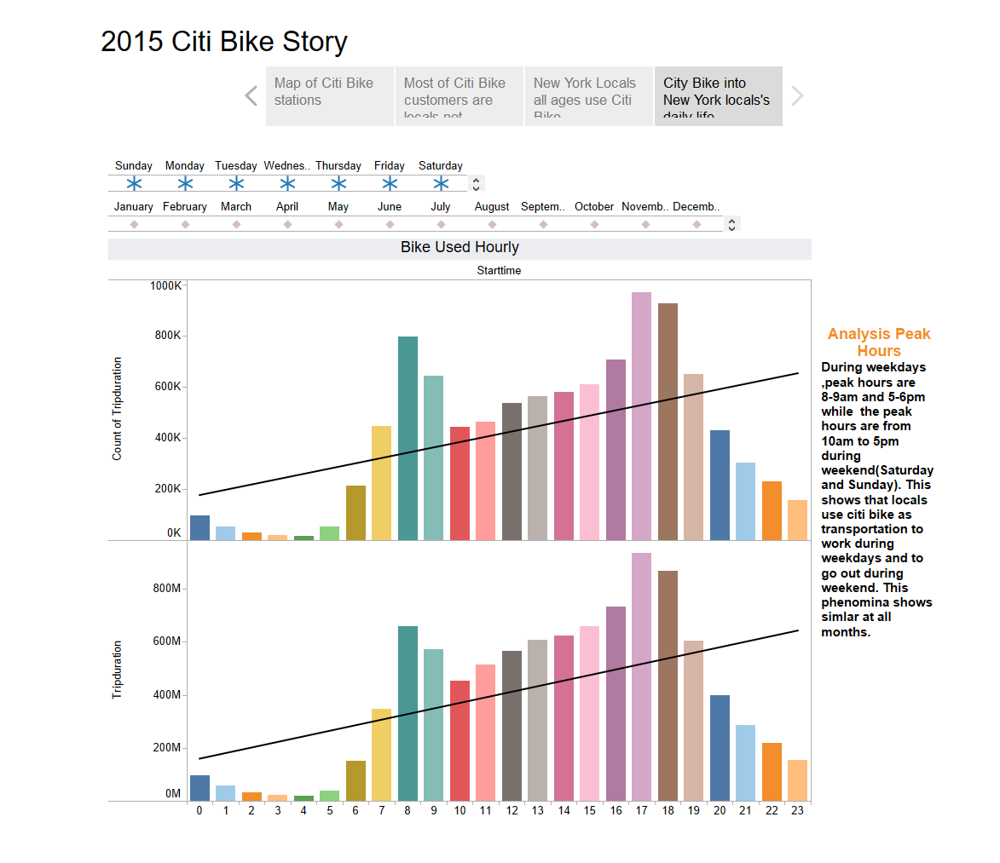

# Tableau

**Citi Bike Analytics  -Citi Bike 2015**

Since 2013, the Citi Bike Program has implemented a robust infrastructure for collecting data on the program's utilization. Through the team's efforts, each month bike data is collected, organized, and made public on the Citi Bike Data webpage：https://www.citibikenyc.com/system-data 。
Ideally, I wanted to use all data and compare the data in different years. However, it takes too much to load the data and it is impossible to update to the web with such large dataset. I decided to use only one-year data. Finally, I chose 2015 due to the 2015 data contains all months and columns in each file are same style, same column name. the dataset is very big, and it is not able to upload to github. Please use the follow link to download data. https://s3.amazonaws.com/tripdata/index.html
After download the data, I checked and made sure that each month data files contain same style columns and the names of the column are same.  Tableau, all files union together to have the full data set.

*Dashboard 1 - to discover the information of usertype vs age group/monthly/gender*

At this dashboard, the interaction is set with hover. When hover on the female, all female relative data will show according. From this dashboard, it shows that in 2015, there are total 9,937,969 rides including Single_Ride($3/ride), Day_Pass ($12/Day) and Annual_Membership $169/year). It finds that 86.8% Subscriber (Annual_Membership) and 13.2% Customer (single_ride or day_pass), Which means mostly locals use Citi-Bike rather than travelers. Unexpectedly, there is NO teenage which defines as under 20 years ole uses Citi-Bike, 70 or older people prefers Day_Pass, all other age group 100% Annual_member base on the data. Single_Ride and Day_Pass has no information about gender, 0.12% of Annual_Members are unknown gender.
Due to without member ID information in the dataset, it is not able to figure out how many single_ride, day_pass, or annual_membership are and the actually financial profit.

*Dashboard 2 - to discover the information of Age group/ gender active time during day, at different month*

At this Dashboard, the interaction is set with hover plus dropdown. From this dashboard, when click around, you will be able to find that 65 and the elder's group are active from 1pm to 5pm versus other groups are active at 8-9am and 5-6pm. This group average trip duration is 28.4 minutes which is much higher than the other age groups less than 15 minutes. Per data, it is because the unknown gender member's average trip duration is 32.9 

*Dashboard 3 - the map of stations distribution*

At this Dashboard, dropdown options are available for weekday and months. It can help to discover the Trend of stations distribution. Generally, the most popular Citi Bank stations are in the central of Manhattan. From April to October, the travel seasons, some of water front stations turns to very popular. It gets less popular when the stations are away from the center of the city. 

*Dashboard 4 – Analysis Peak Hours*

At this Dashboard, I used a different method of interaction. Listing all interaction options on the top of the bar graphs.  By choosing different month of the day, you will be able to find the peak out of the month or the day, or the combination of the day of the month.  It helps to discover the Trend of peak_hour. During weekdays, peak hours are 8-9am and 5-6pm while the peak hours are from 10am to 5pm during weekend (Saturday and Sunday). This shows that locals use citi bike as transportation to work during weekdays and to go out during weekend. This phenomenon shows similar at all months.

I want to analyst and compare the data at different years. Maybe when time is available, it is good to try to use python to do analyst. Tableau is good and easy to use for visualization. Python is more powerful when need to take care of bigger dataset. 
